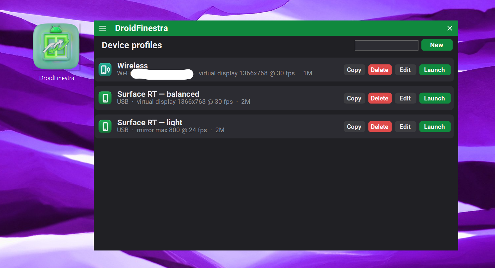
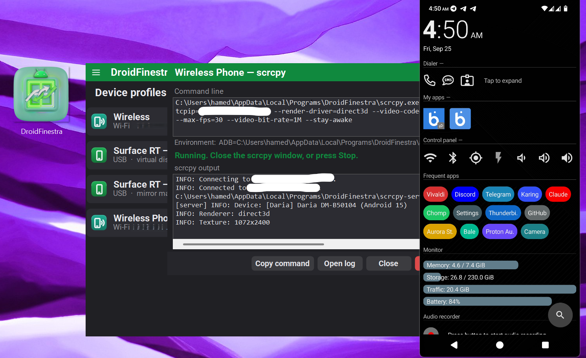

# DroidFinestra

> **Use your Android phone from ARM32 Windows — a GUI for [scrcpy-rt](https://github.com/hamed7ir/scrcpy-rt).**
> Built from [Finestra](https://github.com/hamed7ir/Finestra)'s source. It launches
> [scrcpy](https://github.com/Genymobile/scrcpy); scrcpy is not modified.

DroidFinestra saves device profiles and launches scrcpy with them, over **USB and Wi-Fi**. It runs on
**Windows RT 8.1** (ARM32) and on **64-bit Windows 10/11**. Tested on Windows RT 8.1 and Windows 11 x64.

<p align="center">


</p>

## Download

| | Windows RT 8.1 / ARM32 | 64-bit Windows |
|---|---|---|
| installer | `DroidFinestra-Setup-1.0.0-arm32.exe` | `DroidFinestra-Setup-1.0.0-x64.exe` |
| portable | `DroidFinestra-1.0.0-arm32-portable.zip` | `DroidFinestra-1.0.0-x64-portable.zip` |
| scrcpy and adb | scrcpy-rt, adb-rt, ffmpeg-rt | the official scrcpy release, with Google's adb |

The installer is per-user (no admin), adds a Start-menu shortcut and an uninstall entry, and runs on Windows RT.
**Check requirements** lists anything missing, with download links; it never stops the install.
The portable zip runs from any folder and keeps its profiles there.

## Use

- **New profile** starts from a preset: Surface RT — balanced (the shipping configuration), Surface RT — light,
  or Wireless.
- **Launch** shows the full scrcpy command line, then scrcpy's own output. Each launch is logged.
- **Wi-Fi:** ☰ → Pair a phone over Wi-Fi, then put the connect address in a Wireless profile. Addresses are typed;
  there is no discovery.

**`--render-driver=direct3d` is on in every profile.** Without it the window is black on Tegra 3.

## Requirements

.NET Framework 4.0 or later (built into Windows 8 and later). The x64 package's adb needs the Universal C Runtime,
built into Windows 10/11. The files are not signed, so SmartScreen may warn.

## Build

VS 2022 MSBuild, the .NET Framework 4.0 reference assemblies, and Newtonsoft.Json 13.0.4 in the NuGet cache.

```powershell
.\scripts\build.ps1 -Flavor arm32 -ScrcpyFolder <scrcpy-rt release folder>
.\scripts\build.ps1 -Flavor x64 -ScrcpyZip scrcpy-win64-v4.1.zip
```

See [BUILD.md](BUILD.md).

## Licence

© 2026 Hamed Ghorbani, GPL-3.0-only — [LICENSE](LICENSE). Third-party components:
[THIRD-PARTY-NOTICES.txt](THIRD-PARTY-NOTICES.txt).

## Related

- [scrcpy-rt](https://github.com/hamed7ir/scrcpy-rt), [adb-rt](https://github.com/hamed7ir/adb-rt),
  [ffmpeg-rt](https://github.com/hamed7ir/ffmpeg-rt) — the ARM32 builds
- [Finestra](https://github.com/hamed7ir/Finestra) — the app it is built from
- [scrcpy](https://github.com/Genymobile/scrcpy) — Genymobile
